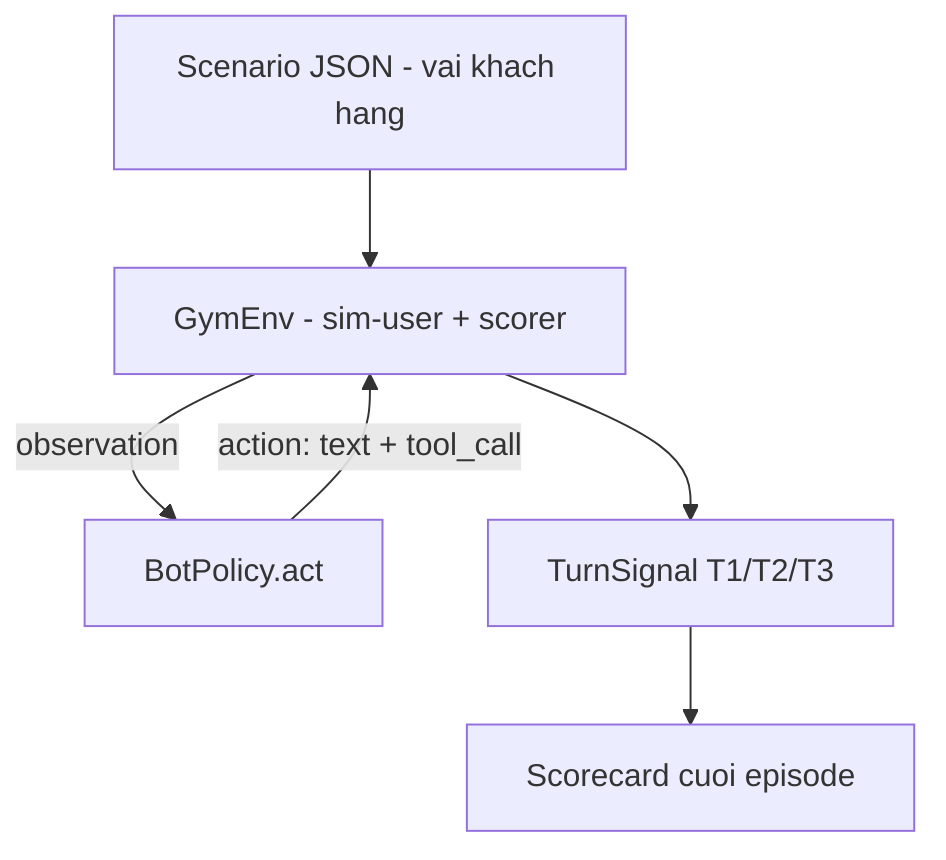

# Exp 05 — Thông luồng bước đầu Gym-env (text mode / tool-calling)

Hiện thực **lát mỏng đầu tiên** của hệ gym-env trong
[docs/11_sim_test_system](../../docs/11_sim_test_system/02_gym_env_and_roles.md):
khép kín vòng lặp `reset() -> act() -> step() -> scorecard` để đo năng lực bot
qua từng lượt, KHÔNG đụng audio/CCU/throughput.

## Vòng lặp



## Hai policy (env giữ nguyên, chỉ thay policy = paired A/B)

| Policy | Chạy ở đâu | Mục đích |
|---|---|---|
| `RuleBasedPolicy` (mặc định) | LOCAL, không cần GPU | thông luồng + kiểm chứng logic env/scorer |
| `LLMPolicy` (Qwen 1.5B) | DGX (torch cu130) | ĐO NĂNG LỰC bot thật trên cùng scenario |

## Chấm điểm 3 tầng (tool-calling)

- **T1 — quyết định**: có gọi/không-gọi tool đúng kỳ vọng không (bắt FN/FP).
- **T2 — chọn tool**: đúng tên tool (chỉ tính khi cả 2 bên đều gọi).
- **T3 — tham số**: đúng args (chỉ tính khi T2 đúng).
- `turn_pass` = quyết định đúng VÀ (nếu cần gọi) đúng tool + đúng args.

## Chạy

```bash
# LOCAL — baseline rule-based (nhanh, deterministic)
python experiments/05_gym_env_text_smoke/run_gym_text.py

# DGX — đo năng lực LLM thật
bash experiments/05_gym_env_text_smoke/setup_dgx.sh
# hoặc: FCI_POLICY=llm uv run python experiments/05_gym_env_text_smoke/run_gym_text.py
```

## Bộ test-case (4 scenario, dùng chung tool verify/lock/get_balance)

| Scenario | Probe điều gì |
|---|---|
| `card_lock_en` | verify -> lock (luồng cơ bản) |
| `balance_after_verify` | verify -> get_balance (chọn đúng tool khác) |
| `chitchat_no_tool` | BẪY FP: chỉ hỏi chung, KHÔNG được gọi tool nào |
| `lock_then_balance` | đa-hành-động: verify -> lock -> get_balance trong 1 cuộc |

## Vòng lặp ĐO -> VÁ trên DGX (Qwen2.5-1.5B, GB10 cuda/fp16)

Đo thật trên DGX, đọc lỗi, vá đúng nguyên nhân, đo lại:

| Bước | micro turn_pass | goal | Vá gì (nguyên nhân thật) |
|---|---|---|---|
| LLM baseline | 75% | 3/4 | (chưa vá) |
| + prompt rules | 88% | 3/4 | cấm gọi tool khi chào/thiếu param; pin ISO date |
| + parser/history | 94% | 4/4 | parser lấy JSON đầu tiên (cân bằng ngoặc); history ghi JSON đúng format |
| + slot-grounding | **100%** | **4/4** | bỏ call nếu giá trị args không có trong lời người dùng (chống bịa slot) |

Baseline `RuleBasedPolicy` (LOCAL, không GPU) trên cùng suite = 75% micro / 2-4
goal — làm mốc đối chiếu rẻ.

> [!IMPORTANT]
> 100% trên 4 scenario nhỏ KHÔNG phải tuyên bố "năng lực bot tốt". Nó chỉ
> chứng minh: (1) harness chạy đúng + bắt lỗi đúng tầng, (2) một bot baseline
> sau khi vá vượt được tập nhỏ này. Giá trị thật đến khi: so phiên bản tương đối
> (A/B), bộ scenario lớn + khó hơn, và `pass^k` cho độ ổn định (xem tech-debt).

## Giới hạn hiện tại (tech-debt, theo thứ tự ưu tiên nâng cấp)

1. **Sim-user agenda-based** (câu kịch bản cố định). Nâng v2: bọc LLM diễn đạt
   lại bề mặt, giữ nguyên nhãn — tăng đa dạng ngôn ngữ (sim-to-real, 01_design §6).
2. **1 scenario duy nhất**. Cần bộ scenario + chỉ số ổn định `pass^k` (τ-bench).
3. **Chỉ text mode**. Audio mode (turn-detection) là exp 06 — cần tổng hợp +
   trộn nhiễu âm thanh.
4. **World-state tối giản** (chỉ ghi tool đã gọi). Chưa mô phỏng hiệu ứng tool
   (vd verify thất bại -> nhánh hội thoại khác).
