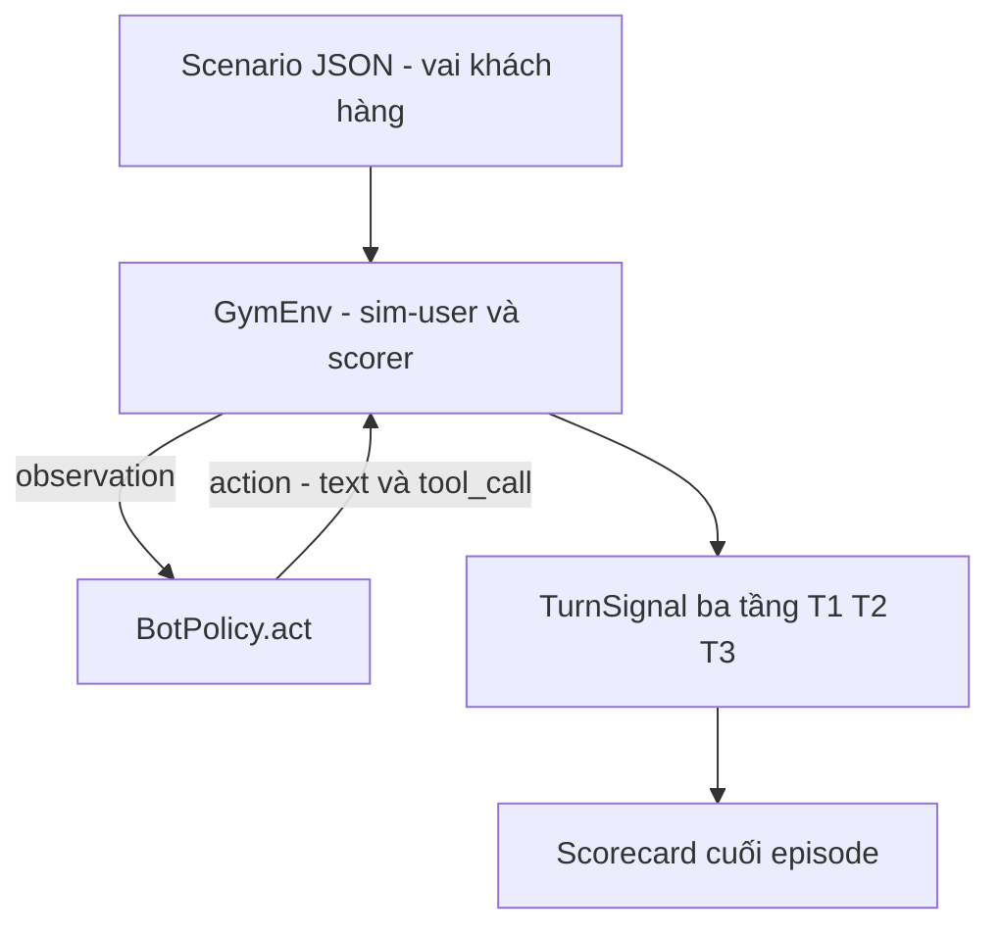

# Exp 05 — Thông luồng gym-env (text mode / tool-calling) · SPEC

**Trạng thái:** đã chạy thật (2026-06-27) · **Môi trường:** local (RuleBased) + DGX GB10 (LLM) · **Loại:** lát mỏng đầu tiên của hệ gym-env

---

## 1. Mục tiêu (đăng ký exp làm gì)

- Hiện thực **lát mỏng đầu tiên** của hệ gym-env (xem `docs/11_sim_test_system/02`): khép kín vòng lặp `reset() → act() → step() → scorecard`.
- Đo năng lực bot tool-calling **qua từng lượt**, KHÔNG đụng audio/CCU/throughput.
- Kiểm chứng env/scorer chạy đúng + **bắt lỗi đúng tầng** (không phải con dấu cao su).

## 2. Flow



**Paired A/B:** env giữ nguyên, CHỈ thay policy.

| Policy | Chạy ở đâu | Mục đích |
|---|---|---|
| `RuleBasedPolicy` (mặc định) | LOCAL, không GPU | thông luồng + kiểm chứng logic env/scorer |
| `LLMPolicy` (Qwen 1.5B) | DGX (torch cu130) | đo năng lực bot thật trên cùng scenario |

**Chấm 3 tầng tool-calling:** T1 quyết-định-gọi (bắt FN/FP) · T2 đúng-tool · T3 đúng-args. `turn_pass` = T1 đúng VÀ (nếu cần gọi) T2+T3 đúng.

## 3. Model & thành phần

- **LLM = Qwen2.5-1.5B-Instruct** (GB10 cuda/fp16). Lib `src/fci_voice/sim/` (types/scorer/sim_user/env/policy).
- Sim-user = agenda-based (câu kịch bản cố định, deterministic).

## 4. Input / Output

- **Input:** 4 scenario JSON (`scenarios/`), tool dùng chung verify/lock/get_balance.
- **Output:** scorecard per-turn + suite micro/macro turn_pass + goal_success.

## 5. Tiêu chí nghiệm thu (KỲ VỌNG)

| Hạng mục | Kỳ vọng |
|---|---|
| Vòng lặp khép kín | reset→act→step chạy hết mọi scenario |
| Scorer bắt đúng tầng | phân biệt được FN/FP (T1), sai-tool (T2), sai-args (T3) |
| RuleBased baseline | làm mốc rẻ (không cần đạt cao) |
| LLMPolicy | đo được năng lực; vòng đo→vá đẩy được điểm lên |

**Bộ test-case:** `card_lock` (verify→lock) · `balance_after_verify` (chọn tool khác) · `chitchat_no_tool` (BẪY FP: không được gọi tool) · `lock_then_balance` (đa-hành-động).

## 6. Cách chạy

```bash
# LOCAL — baseline rule-based
python experiments/05_gym_env_text_smoke/run_gym_text.py
# DGX — đo năng lực LLM thật
ssh dgx "cd fci_voice_agent && FCI_POLICY=llm uv run python experiments/05_gym_env_text_smoke/run_gym_text.py"
```
