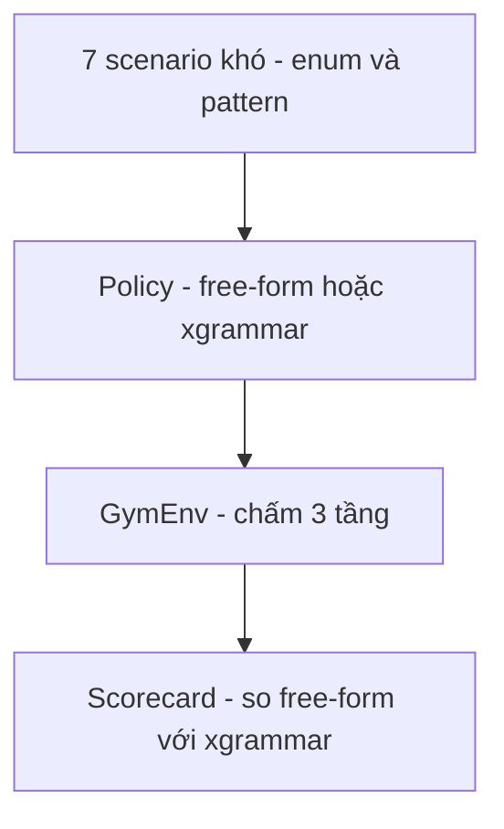

# Exp 06 — Suite tool-calling KHÓ + structured decoding (xgrammar) · SPEC

**Trạng thái:** đã chạy thật (2026-06-27) · **Môi trường:** DGX GB10 · **Loại:** suite khó + đối chứng free-form vs constrained

---

## 1. Mục tiêu (đăng ký exp làm gì)

- Bộ **~20 case khó** cố tình bẻ gãy free-form JSON của LLM nhỏ (Qwen2.5-1.5B).
- Chứng minh **structured decoding** (xgrammar ép JSON-schema) **vá đúng lớp lỗi nào** — và lộ lớp lỗi nào grammar KHÔNG cứu được.
- Dùng chung khung gym-env của exp05 (chỉ đổi `FCI_SCEN_DIR` + `FCI_POLICY`).

## 2. Flow



- 3 policy trên cùng 7 scenario: `RuleBased` (mốc local) → `LLMPolicy` free-form JSON → `XGrammarToolPolicy` constrained (± reasoning).
- xgrammar: `xgr.contrib.hf.LogitsProcessor` + `compile_json_schema` → discriminated-union `{tool-enum, args-per-tool, nhánh "none"}` → mask token sai mỗi bước.

## 3. Model & thành phần

- **LLM = Qwen2.5-1.5B-Instruct** (GB10 cuda/fp16) + **xgrammar** (wheel **aarch64** chạy được trên GB10).
- Deps DGX: `uv sync --extra exp03 --extra exp06`.
- Tool dùng chung `scenarios/tools_bank_hard.json`: **enum** (reason/period/currency/category/country_code) + **pattern** (`AC-\d{4}`, `TX\d{6}`, last4, ngày ISO) — đúng chỗ free-form hay sai.

## 4. Input / Output

- **Input:** 7 scenario · 22 lượt chấm (h1..h7).
- **Output:** scorecard 3 tầng + suite micro turn_pass + goal.

| Scenario | Probe điểm khó |
|---|---|
| h1_block_reason_enum | enum reason từ paraphrase ("taken"→stolen); dob → ISO |
| h2_distractor_and_correction | số 16 chữ số nhiễu; thiếu slot → phải hỏi; sửa last4 |
| h3_transfer_currency_enum | enum currency ("euros"→EUR); 2 slot cùng kiểu |
| h4_dispute_pattern_enum | pattern txn; enum category từ paraphrase |
| h5_statement_vs_balance | chọn đúng tool gần giống nhau; nhớ account |
| h6_refuse_verify_and_oos | từ chối xác thực + yêu cầu ngoài phạm vi (bịa tool) |
| h7_travel_json_hostile | enum country ("France"→FR); input có nháy/ngoặc nhọn |

## 5. Tiêu chí nghiệm thu (KỲ VỌNG)

| Hạng mục | Kỳ vọng |
|---|---|
| Free-form trên suite khó | điểm THẤP (lỗi dồn ở enum/cấu trúc/bịa-tool) — bằng chứng cần grammar |
| xgrammar | **vá sạch lỗi format/enum-ngoài-tập/bịa-tool** → điểm tăng rõ |
| Residual sau xgrammar | còn lỗi NGỮ NGHĨA/QUYẾT ĐỊNH (grammar không cứu) |
| reasoning (think-then-constrain) | giả thuyết cải thiện — kiểm chứng ở 1.5B |

## 6. Cách chạy

```bash
HARD=experiments/06_gym_env_hard/scenarios
ssh dgx "cd fci_voice_agent && FCI_SCEN_DIR=$HARD FCI_POLICY=llm      uv run python experiments/05_gym_env_text_smoke/run_gym_text.py"
ssh dgx "cd fci_voice_agent && FCI_SCEN_DIR=$HARD FCI_POLICY=xgrammar uv run python experiments/05_gym_env_text_smoke/run_gym_text.py"
ssh dgx "cd fci_voice_agent && FCI_SCEN_DIR=$HARD FCI_POLICY=xgrammar FCI_REASONING=1 uv run python experiments/05_gym_env_text_smoke/run_gym_text.py"
```
