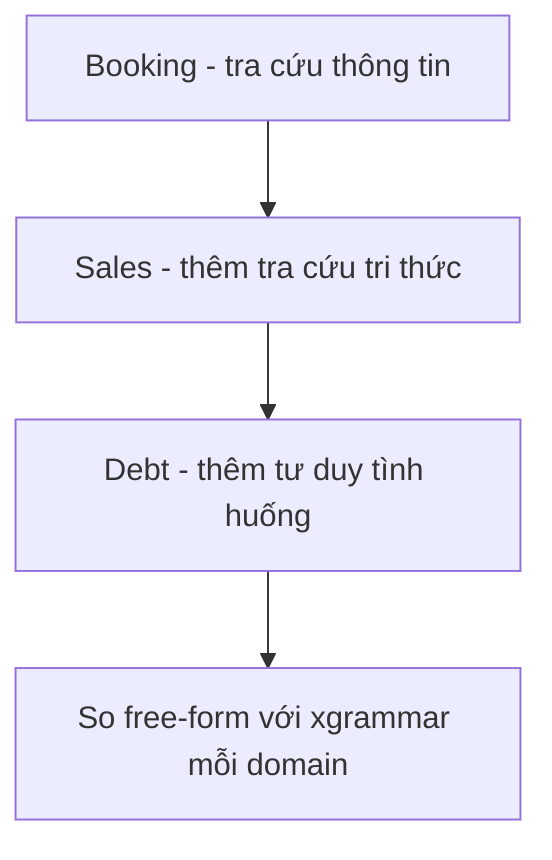

# Exp 07 — Scale test-case ra 3 domain CSKH (thang năng lực tăng dần) · SPEC

**Trạng thái:** đã chạy thật (2026-06-27) · **Môi trường:** DGX GB10 · **Loại:** scale suite theo thang năng lực

---

## 1. Mục tiêu (đăng ký exp làm gì)

- Mở rộng bộ kịch bản tool-calling sang **3 nhóm domain thật của FCI**, mỗi domain **kế thừa năng lực domain trước + thêm một lớp khó**.
- Đo xem structured decoding (xgrammar) **vá tới đâu, hụt ở đâu** khi độ phức tạp nghiệp vụ tăng dần.
- Dùng lại khung gym-env exp05 + structured decoding exp06; mỗi domain là một thư mục suite (chạy qua `FCI_SCEN_DIR`).

## 2. Flow — thang năng lực



| Domain | Năng lực tích lũy | Tool đặc trưng | Lớp khó MỚI |
|---|---|---|---|
| **booking** (đặt lịch) | tra cứu thông tin | check_availability, create/reschedule/cancel_booking | trích slot + action có xác nhận |
| **sales** (bán hàng) | + tra cứu **tri thức** | search_knowledge(topic enum), recommend_offer, mark_not_interested | định tuyến RAG theo topic + opt-out |
| **debt** (đòi nợ) | + **tư duy tình huống** | verify_debtor(gate), get_debt_details, search_policy, offer_payment_plan, escalate_to_human | cổng anti-IDOR + phán đoán escalate/plan + compliance |

**2 điểm thiết kế:**
- **Tri thức vẫn chấm được:** `search_knowledge`/`search_policy` nhận tham số `topic` dạng **enum** (không phải truy vấn tự do) → vừa chấm bằng scorer 3 tầng, vừa ép được bằng grammar.
- **Compliance đặt trong `goal`:** luật nghiệp vụ ("phải xác thực trước khi tiết lộ nợ", "không tiết lộ cho bên thứ ba") nằm ở field `goal` → chảy vào system prompt → test đo việc model **tuân thủ** chính sách đã nêu, không đoán mò.

## 3. Model & thành phần

- **LLM = Qwen2.5-1.5B-Instruct** (GB10), policy `llm` (free-form) vs `xgrammar` (constrained).
- Mỗi domain có file tool riêng `tools_<domain>.json`, tái dùng qua `tools_ref`.

## 4. Input / Output

- **Input:** 17 scenario · ~41 lượt (booking 5 · sales 6 · debt 6).
- **Output:** scorecard 3 tầng per-domain, so free-form vs xgrammar.

## 5. Tiêu chí nghiệm thu (KỲ VỌNG)

| Hạng mục | Kỳ vọng |
|---|---|
| booking | điểm CAO sau xgrammar (thuần định-dạng + trích-xuất → grammar đưa lên trần) |
| sales | residual TĂNG — lỗi định tuyến tri thức (chọn sai topic enum) grammar không cứu |
| debt | residual LỚN NHẤT — tư duy tình huống + compliance grammar không ép được |
| Quy luật chung | càng lên thang, structured decoding càng để lại nhiều residual |

## 6. Cách chạy

```bash
for d in booking sales debt; do
  for p in llm xgrammar; do
    ssh dgx "cd fci_voice_agent && FCI_SCEN_DIR=experiments/07_domain_suites/$d \
      FCI_POLICY=$p uv run python experiments/05_gym_env_text_smoke/run_gym_text.py"
  done
done
```
