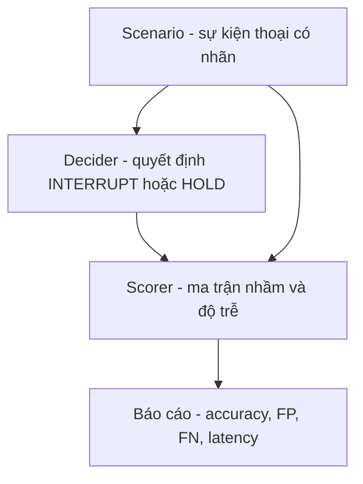

# Exp 08 — Harness phát hiện lượt thoại (turn-detection, text/event-first) · SPEC

**Trạng thái:** đã chạy thật (2026-06-27) · **Môi trường:** local (2 baseline) · DGX cho LLM (sau) · **Loại:** điểm đau #2

---

## 1. Mục tiêu (đăng ký exp làm gì)

- Hiện thực harness kiểm thử module **phát hiện lượt thoại** — điểm đau #2 (ngắt lời ~76%/280ms → đích ≥85%/≤150ms).
- Làm **text/event-first** (chưa render audio) GIỐNG cách thông luồng tool-calling trước khi đụng audio: rẻ, chạy LOCAL không cần DGX, kiểm chứng logic scorer trước.
- Dựng A/B chứng minh **semantic turn-detection thắng energy-VAD ở đúng lớp ngắt-nhầm (FP)**.

## 2. Flow



- **Scenario** = `agent_utterance` + luồng `events` (mỗi event: speaker `user`/`other`/`noise` + text ASR + `t_start_s` + `duration_s`) → nhãn `expected` INTERRUPT/HOLD.
- **QUY ƯỚC chống chấm-vòng-tròn:** decider CHỈ đọc đặc trưng quan sát được (speaker/text/timing), KHÔNG đọc `tag`/`expected`.

## 3. Model & thành phần

- Thư viện `src/fci_voice/sim/turn_*.py` (types/scorer/decider/scenario).
- **3 bậc decider** (song song policy tool-calling):

| Decider | Cơ chế | Chạy ở đâu |
|---|---|---|
| `energy_vad` | phản ứng theo năng lượng/độ dài, mù ngữ nghĩa (baseline yếu) | local |
| `semantic_rule` | lọc người nói + lexicon stop-keyword/backchannel (baseline mạnh) | local |
| `llm_semantic` | LLM (Qwen1.5B) phán đoán ý định | DGX (đo sau) |

## 4. Input / Output

- **Input:** 17 scenario — 11 quiet (`scenarios/quiet/`, N1-N6) + 6 noisy (`scenarios/noisy/`, nhạc/TV/cross-talk).
- **Output:** ma trận nhầm (TP/FP/FN/TN) + accuracy/precision/recall + latency (synthetic).

## 5. Tiêu chí nghiệm thu (KỲ VỌNG)

| Hạng mục | Kỳ vọng |
|---|---|
| energy_vad | accuracy thấp (~mức đau 76%), FP cao (ngắt nhầm âm-đệm-dài/side-talk/nhiễu), recall ~100% |
| semantic_rule | **vá sạch lớp FP** → accuracy cao hơn rõ |
| Harness phân biệt được 2 decider | có (chứng minh scorer không phải con dấu) |
| latency | đo được, NHƯNG là synthetic — chỉ lộ trục đánh đổi nhanh/đúng |

## 6. Cách chạy

```bash
cd fci_voice_agent
FCI_DECIDER=energy_vad    python3 experiments/08_turn_detection/run_turn.py
FCI_DECIDER=semantic_rule python3 experiments/08_turn_detection/run_turn.py
# LLM (DGX):
ssh dgx "cd fci_voice_agent && FCI_DECIDER=llm_semantic uv run python experiments/08_turn_detection/run_turn.py"
```

> Lý thuyết + caveat đầy đủ: `docs/11_sim_test_system/04_turn_detection.md`.
