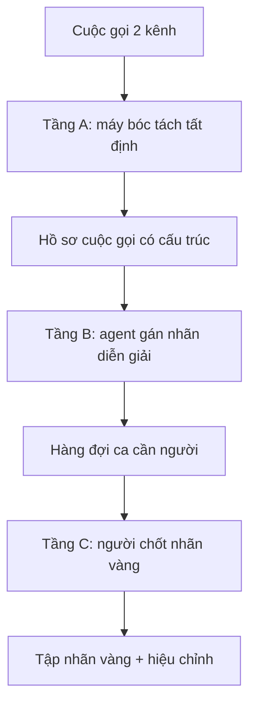

# exp10 — Phân tích sâu từng hội thoại: kế hoạch

> **Vai trò:**
>
> Kế hoạch cho một exp bóc tách và đánh giá **từng cuộc gọi** ở mức chi tiết, chưa viết code.
>
> Chia rõ phần máy chạy tất định, phần agent đánh giá, phần người đánh giá, cùng mini-tool và danh mục tín hiệu.

---

## Glossary

- `call` → **một cuộc gọi** → một file ghi âm hai kênh, đơn vị phân tích của exp này.
- `turn` → **lượt lời** → một đoạn một bên nói liên tục.
- `barge-in` → **barge-in** → khách bật tiếng khi bot đang nói.
- `stop-latency` → **stop latency** → khoảng từ lúc khách chen tới lúc bot thật sự tắt tiếng.
- `readback` → **readback** → câu bot đọc lại thông tin vừa nhận, dùng để soi lỗi ASR.
- `VAD` → **Voice Activity Detection** → phát hiện khung có tiếng nói.
- `SIR` → **Signal-to-Interference Ratio** → tỉ lệ năng lượng khách trên bot trong vùng chồng lấn.
- `gold` → **gold label** → nhãn người chốt, dùng làm chuẩn.

---

## 1. Dẫn dắt bối cảnh

- **Đã có:**
  - lát audio thật (36 file hai kênh), đã đo ở [../../docs/14_turn_detection_delivery/06_bargein_measurements.md](../../docs/14_turn_detection_delivery/06_bargein_measurements.md),
  - một file nhãn người chấm của FCI `data/Testcase_Ngắt lời - Copy.xlsx` (132 call_id, hai môi trường yên tĩnh và ồn).
- **Nghịch lý cần biết trước khi làm:**
  - 132 call_id trong xlsx **không trùng** file audio nào ta đang có (đối chiếu ra 0 khớp),
  - nên xlsx dùng làm **tham chiếu schema và taxonomy**, không phải nhãn trực tiếp cho 36 file.

> exp này dựng một dây chuyền soi từng cuộc: máy bóc tách tín hiệu, agent gán nhãn diễn giải, người chốt nhãn vàng trên mẫu và ca tranh cãi.
>
> Mục tiêu cuối là mỗi cuộc có một hồ sơ đọc được, và một tập nhãn vàng nhỏ để tin các con số tự động.

---

## 2. Mục tiêu và đơn vị

- **Mục tiêu exp:**
  - biến mỗi cuộc gọi thô thành một **hồ sơ cuộc gọi** có cấu trúc, đọc và nghe lại được,
  - đo các tín hiệu turn-taking khớp đúng cột đánh giá của FCI để số có thể so trực tiếp,
  - tạo tập nhãn vàng nhỏ do người chốt để hiệu chỉnh nhãn tự động.
- **Đơn vị phân tích** là một cuộc gọi; mọi bước chạy theo từng cuộc rồi mới gộp thống kê.
- **Taxonomy barge-in dùng chung, lấy đúng 6 nhóm của FCI:**
  - **Nhóm 1** — khách thực sự muốn ngắt lời,
  - **Nhóm 2** — backchannel, phản hồi ngắn,
  - **Nhóm 3** — khách gọi người khác, side conversation,
  - **Nhóm 4** — khách bắt đầu nói nhưng dừng ngay,
  - **Nhóm 5** — khách nói đè toàn bộ agent,
  - **Nhóm 6** — khách dùng từ khóa ngắt lời như "dừng lại".

---

## 3. Kiến trúc ba tầng

**Khung đọc sơ đồ:**

- **Đề bài:** đặt ba loại lao động đúng chỗ theo chi phí tăng dần, máy rẻ nhất, người đắt nhất.
- **Cách đọc:** máy bóc tất cả, agent gán nhãn hàng loạt, người chỉ chạm mẫu và ca tranh cãi; nhãn vàng chảy ngược về hiệu chỉnh nhãn tự động.

---

## 4. Tầng A — phần máy chạy tất định

Đây là phần chạy lại cho ra cùng kết quả, không phán đoán, tái dùng script đã có ở lát trước.

- **A1 — tách kênh và VAD:**
  - giải mã μ-law sang PCM, tách kênh bot và kênh khách,
  - năng lượng khung 20ms, ngưỡng Otsu, ra đoạn có tiếng từng kênh,
  - gán vai bot theo kênh chào trước 4 giây đầu.
- **A2 — ASR hai kênh:**
  - chạy FastConformer 114M từng đoạn hai kênh, ra transcript kèm mốc thời gian,
  - giữ điểm tin cậy hoặc logprob nếu model trả được, để làm tín hiệu cho tầng sau.
- **A3 — dựng dòng lượt:**
  - gộp đoạn VAD thành lượt từng bên, ra một dòng thời gian thống nhất gồm speaker, mốc đầu, mốc cuối, text,
  - tính khoảng lặng giữa các lượt, phục vụ bài endpointing.
- **A4 — rút sự kiện barge-in:**
  - đánh dấu onset khách khi bot đang nói, đo độ dài chồng lấn và SIR,
  - với mỗi sự kiện ghi kèm text khách, text bot đang nói, độ dài clip.
- **A5 — đo hành vi dừng của bot, tín hiệu quan trọng nhất:**
  - kiểm kênh bot có tắt tiếng trong N mili-giây sau onset khách không,
  - có tắt là bot tôn trọng ngắt, không tắt là bỏ sót ngắt; khoảng cách là stop-latency,
  - đây chính là cột turn pass hay fail mà FCI đang chấm.
- **A6 — soi lỗi ASR qua readback:**
  - so câu bot đọc lại "em ghi nhận số ... là X" với con số khách vừa nói,
  - lệch nhau là bằng chứng bot nghe sai, tất định bằng so chuỗi, không cần phán đoán.
- **A7 — gộp chỉ số mỗi cuộc theo cột FCI:**
  - số turn khách muốn ngắt, số turn không yêu cầu ngắt, số turn pass, số turn bị ngắt nhầm do nhiễu hoặc ASR,
  - phân bố stop-latency so ngân sách 150ms.
- **Đầu ra tầng A:**
  - một JSON có cấu trúc cho mỗi cuộc,
  - một file transcript dòng thời gian dạng markdown cho mỗi cuộc, đã ẩn dãy số.

---

## 5. Tầng B — phần agent đánh giá

Agent đọc hồ sơ có cấu trúc rồi gán nhãn diễn giải; đầu ra bắt buộc được kiểm lại vì phán đoán ngôn ngữ có thể sai.

- **B1 — gán nhóm barge-in:**
  - phân mỗi sự kiện vào 6 nhóm FCI, thay cho luật từ vựng thô ở lát trước,
  - lý do chọn nhóm ghi kèm để người soi nhanh.
- **B2 — gán hành động đúng mong đợi:**
  - với mỗi sự kiện, agent nói bot nên dừng hay giữ, dựa trên text và ngữ cảnh,
  - đối chiếu với hành vi thật ở A5 ra bốn ô đúng sai gồm dừng đúng, dừng nhầm, giữ đúng, bỏ sót.
- **B3 — gán loại lỗi ASR:**
  - đọc cặp readback và lời khách ở A6, phân loại lỗi số, tên riêng, thực thể,
  - ước lượng lỗi này có phải nguyên nhân đẩy khách ngắt lời không.
- **B4 — tóm tắt cấp cuộc gọi:**
  - cuộc về việc gì, có hoàn thành không, hỏng ở đâu, nguyên nhân gốc,
  - đếm số vòng lặp sửa thông tin.
- **B5 — soi ranh giới lượt:**
  - kiểm dòng lượt tự động có khớp lượt theo ngữ nghĩa không, cờ chỗ cắt sai.
- **Kỷ luật kiểm chứng:**
  - một agent thứ hai phản biện nhãn của agent thứ nhất trên ca khó,
  - chỉ nhãn hai agent đồng ý mới coi là ổn định, ca lệch đẩy sang người.

---

## 6. Tầng C — phần người đánh giá

Người chỉ chạm mẫu và ca tranh cãi, không nghe hết mọi cuộc.

- **C1 — nghe và chốt nhóm barge-in** trên ca agent phân vân hoặc hai agent lệch nhau.
- **C2 — nghe xác nhận hành vi dừng của bot** ở ca ranh giới, cảm giác cắt lời hay bỏ sót.
- **C3 — xác nhận transcript ở chỗ quyết định**, nhất là con số và tên trong readback.
- **C4 — hiệu chỉnh ngưỡng đo tự động** cho khớp cảm nhận và khớp cột của xlsx.
- **C5 — chấm chất lượng cấp cuộc gọi** theo cảm nhận trải nghiệm, thứ máy khó lượng hóa.
- **Quy tắc chọn mẫu:**
  - toàn bộ ca tranh cãi giữa máy và agent,
  - cộng một mẫu ngẫu nhiên các ca máy và agent đồng ý, để bắt lỗi hệ thống.

---

## 7. Mini-tool giúp người review

Mọi tool ở dạng file cục bộ, terminal, wav và markdown; không dựng trang web.

- **T1 — transcript dòng thời gian mỗi cuộc, dạng markdown:**
  - hai cột bot và khách theo mốc thời gian, có cờ đánh dấu sự kiện barge-in và loại,
  - người đọc thẳng trong editor, giống bảng ở doc 06 nhưng cho từng cuộc.
- **T2 — cắt clip theo mốc, dạng lệnh:**
  - đưa call và mốc giây, tool cắt ra wav kênh khách, kênh bot và bản trộn để nghe một sự kiện,
  - phục vụ C1 tới C3, nghe đúng chỗ không phải tua cả cuộc.
- **T3 — hàng đợi review, dạng bảng cho Excel:**
  - mỗi dòng một sự kiện cần người, điền sẵn nhãn máy và nhãn agent, chừa cột cho người sửa,
  - xuất `.xlsx` hoặc `.csv` để mở bằng công cụ quen thuộc, khớp thói quen chấm của FCI.
- **T4 — bản trộn hai kênh kèm mốc đánh dấu, dạng wav:**
  - trộn bot sang trái, khách sang phải, chèn tiếng bíp ngắn tại mỗi onset barge-in,
  - nghe một lượt cả cuộc mà vẫn định vị được sự kiện.
- **T5 — bảng chỉ số mỗi cuộc, dạng markdown gộp:**
  - một bảng tổng các cuộc theo cột FCI, để nhìn bức tranh và chọn cuộc đáng soi sâu.

---

## 8. Danh mục tín hiệu và dữ liệu cần đánh giá

Xếp theo bốn bài con của turn-taking cộng hai lớp bao ngoài.

| Nhóm tín hiệu | Đại lượng cụ thể | Ai lượng hóa |
| --- | --- | --- |
| Cấu trúc lượt (B1) | số lượt mỗi bên, độ dài lượt, khoảng lặng cuối lượt, độ trễ vào lượt | máy A3 |
| Barge-in (B2) | onset, độ dài chồng lấn, SIR, stop-latency, bot có dừng không, hành động đúng mong đợi | máy A4 A5, agent B2 |
| Backchannel (B3) | tiếng đế ngắn khi bot nói, có bị tính nhầm là ngắt không | agent B1 nhóm 2 |
| Chất lượng ASR | readback khớp lời khách không, điểm tin cậy, tỉ lệ lỗi số | máy A6, agent B3 |
| Âm học và nhiễu (B4) | SNR mỗi kênh, có giọng nền, có dấu echo | máy A1 mở rộng |
| Kết cục cuộc gọi | cuộc có hoàn thành không, số vòng lặp sửa, dấu bực bội | agent B4, người C5 |

**Cách đọc bảng:**

- **Cột ai lượng hóa** cho biết tín hiệu nào máy đo được chắc, tín hiệu nào cần agent hoặc người.
- **Dòng chất lượng ASR** là gốc rễ nhiều barge-in, nên đặt ngang hàng với bài turn-taking chứ không phụ.
- **Dòng kết cục** là thứ khó nhất, phần lớn dựa vào người, dùng để neo ý nghĩa của mọi số kỹ thuật.

---

## 9. Cấu trúc folder và thứ tự thực thi

- **Cấu trúc dự kiến:**
  - `pipeline/` chứa các bước máy A1 tới A7,
  - `agent/` chứa prompt và runner cho tầng B,
  - `tools/` chứa mini-tool T1 tới T5,
  - `out/` chứa hồ sơ mỗi cuộc, không commit audio và không commit dãy số thật,
  - `README.md` và `RESULT.md` theo nếp các exp trước.
- **Thứ tự làm, chia scope nhỏ độc lập:**
  - **Scope 1** — máy tầng A ra hồ sơ JSON và transcript markdown cho một cuộc, chạy được đầu cuối.
  - **Scope 2** — mini-tool T1 T2 để người xem và nghe được một cuộc.
  - **Scope 3** — agent tầng B trên hồ sơ, kèm kiểm chứng hai agent.
  - **Scope 4** — hàng đợi review T3 và vòng người tầng C trên mẫu nhỏ.
  - **Scope 5** — gộp thống kê cả 36 cuộc và bảng chỉ số T5.
- Mỗi scope làm xong báo cáo rồi mới sang scope sau, không gộp.

---

## 10. Nghiệm thu

- **Scope máy đạt khi:** một cuộc ra được hồ sơ JSON và transcript markdown, mốc barge-in và stop-latency đọc được.
- **Scope agent đạt khi:** nhãn 6 nhóm và bốn ô đúng sai sinh tự động, hai agent đồng ý phần lớn, ca lệch vào hàng đợi.
- **Scope người đạt khi:** có một tập nhãn vàng nhỏ do người chốt, và một bảng lệch giữa nhãn tự động với nhãn vàng.
- **Điều kiện neo:** số tự động chỉ đáng tin khi tương quan thứ hạng với nhãn vàng đủ cao trên mẫu người đã chấm.

---

## 11. Việc cần hỏi FCI, ghi để không quên

- **Xin audio cho các call_id đã có nhãn** trong xlsx, hoặc xin nhãn cho 36 file đang có, để nối nhãn vàng với audio.
- **Xin log trạng thái bot** gồm câu TTS kèm mốc và điểm tin cậy ASR, để thay hành vi dừng suy đoán bằng sự kiện thật.
- Đưa hai mục này vào [../../docs/13_delivery_plan/01_fci_info_requests.md](../../docs/13_delivery_plan/01_fci_info_requests.md).

---

## ✅ Tự kiểm nhanh

- **Vì sao chia ba tầng máy, agent, người?**
  

đáp án

  để đặt lao động đúng chi phí: máy bóc tất định rẻ, agent gán nhãn hàng loạt, người chỉ chốt mẫu và ca tranh cãi.
  

- **Tín hiệu quan trọng nhất của bài barge-in là gì?**
  

đáp án

  bot có thật sự tắt tiếng sau khi khách chen không, và trễ bao lâu; đây chính là cột turn pass hay fail của FCI.
  

- **Vì sao xlsx không dùng làm nhãn trực tiếp?**
  

đáp án

  132 call_id trong xlsx không trùng file audio nào đang có, nên chỉ dùng làm tham chiếu taxonomy và cột đánh giá.
  

